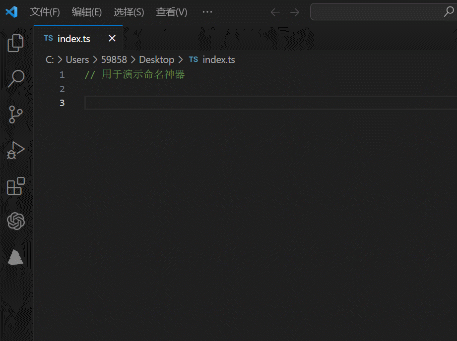
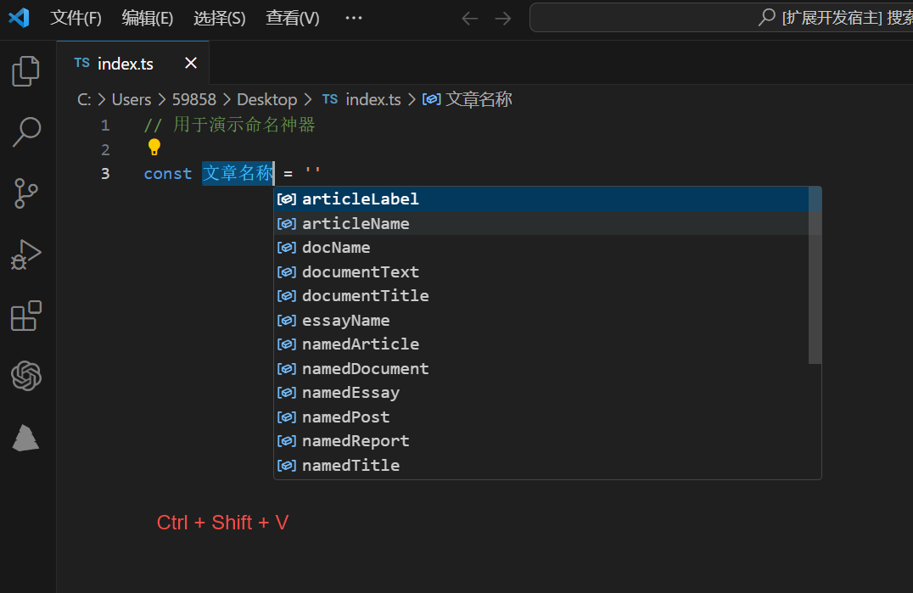
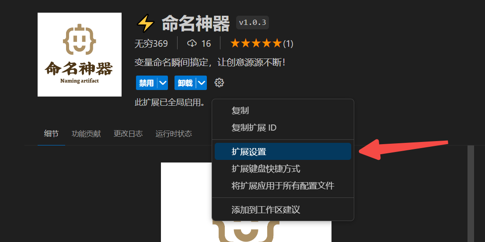
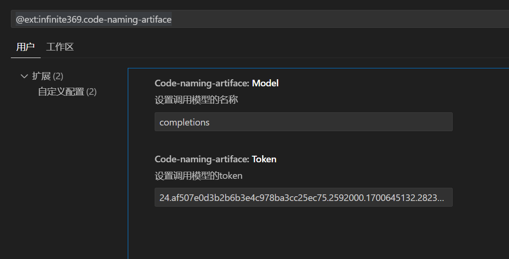
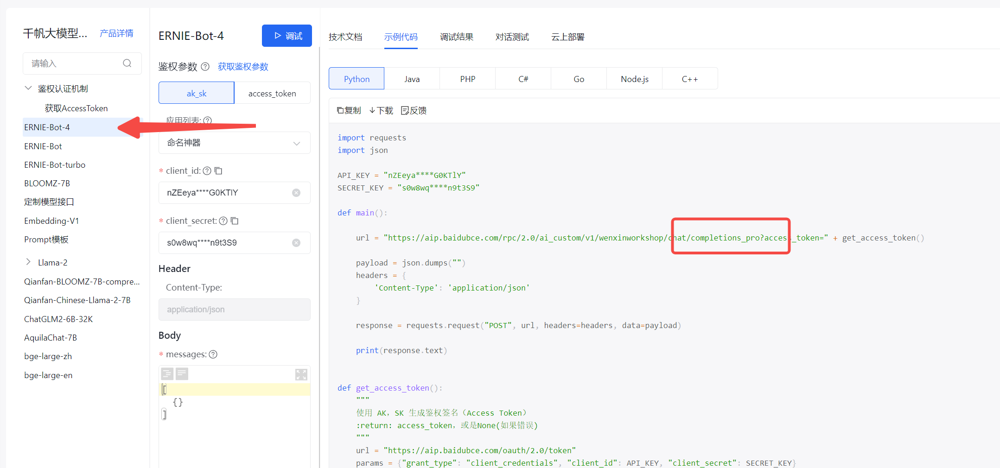

<!--
 * @Author: zhangyu
 * @Date: 2023-10-12 19:10:16
 * @LastEditTime: 2023-10-23 21:01:35
-->

<h2 align="center">
    
    
变量命名瞬间搞定，让创意源源不断！

</h2>

### 🚀 使用方法

 

#### 方法1:

选中你的变量名，然后右键菜单，可以看到命名神器的选项，点击后可以看到出现若干条智能提示，选择你喜欢的变量名即可自动替换，并在该行代码前添加注释

    

 

#### 方法2:

选中你的变量名，通过按快捷键 Ctrl + Shift + V 快速调起智能提示，选择你喜欢的变量名即可自动替换，并在该行代码前添加注释

    

 

### ⚙️ 自定义模型

 

    

 

    

 

可以通过自定义配置来设置你自己的模型，从而达到最适合于你的效果，[千帆大模型列表](https://cloud.baidu.com/doc/WENXINWORKSHOP/s/Nlks5zkzu)

注意：模型的名称要填实际接口定义的模型名 [API在线测试](https://console.bce.baidu.com/tools/?_=1698065492620#/api?product=AI&project=%E5%8D%83%E5%B8%86%E5%A4%A7%E6%A8%A1%E5%9E%8B%E5%B9%B3%E5%8F%B0&parent=ERNIE-Bot-4&api=rpc%2F2.0%2Fai_custom%2Fv1%2Fwenxinworkshop%2Fchat%2Fcompletions_pro&method=post)

 

    

### ⚓️ 更新日志

v1.0.5

> 2023-10-23

* 配置注意事项

v1.0.4

> 2023-10-23

* 新增用户自定义配置模型

v1.0.3

> 2023-10-23

* 使用ERNIE-Bot-4模型

v1.0.2

> 2023-10-23

* 新增更新日志

v1.0.1

> 2023-10-23

* 使用Llama-2-70b-chat模型

v1.0.0

> 2023-10-13

* 首次发版